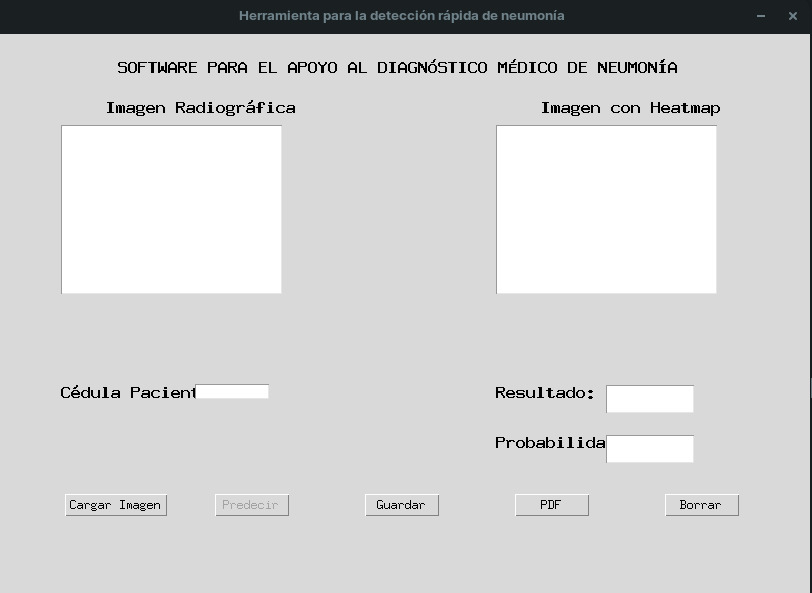
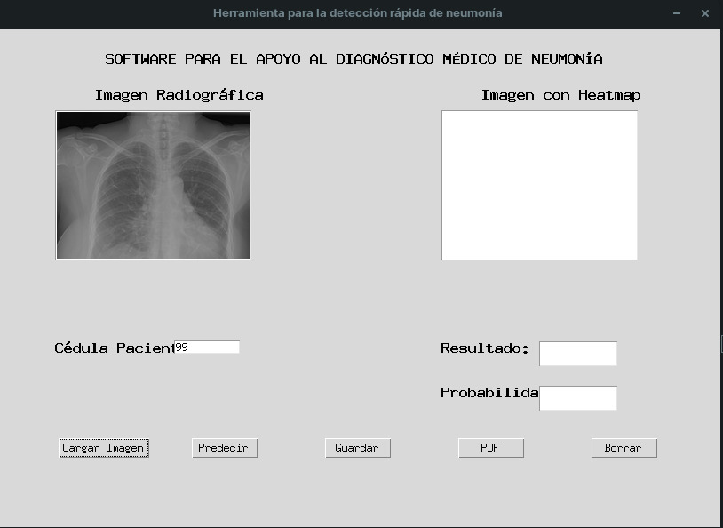
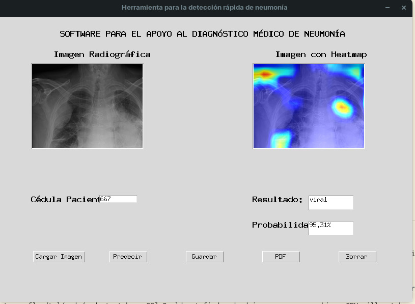
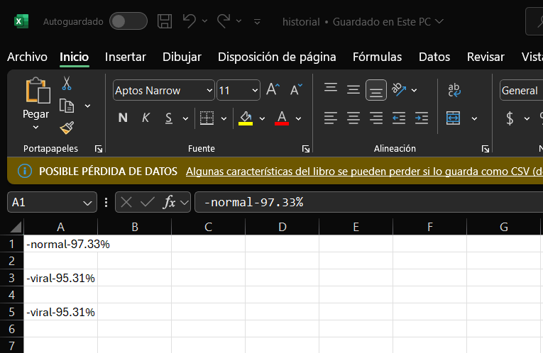
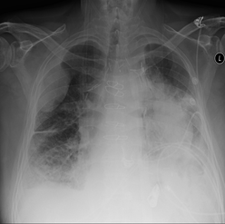

# Sistema de Detección de Neumonía con Deep Learning

  

[](https://www.python.org/downloads/release/python-390/)

[](https://tensorflow.org)

  

## Descripción

Deep Learning aplicado en el procesamiento de imágenes radiográficas de tórax en formato DICOM con el fin de clasificarlas en 3 categorías diferentes:

  

1. Neumonía Bacteriana

  

2. Neumonía Viral

  

3. Sin Neumonía

  

Aplicación de una técnica de explicación llamada Grad-CAM para resaltar con un mapa de calor las regiones relevantes de la imagen de entrada.

  

## Instalación y Configuración

  

### Requisitos Previos

- Python 3.9

- Anaconda o Miniconda

- CUDA (opcional para aceleración GPU)

  

### Paso a Paso

1. Clonar el repositorio:

```bash
git  clone  https://github.com/antonio86-uao/proyecto_neumonia.git
cd  proyecto-neumonia
```

2.  Crear  y  activar  entorno  virtual:

  

-  Instale  Anaconda  para  Windows  siguiendo  las  siguientes  instrucciones:

https://docs.anaconda.com/anaconda/install/windows/

  

-  Abra  Anaconda  Prompt  y  ejecute  las  siguientes  instrucciones:

```bash
conda create -n tf python=3.9
conda activate tf
  ```

3. Instalar dependencias:

```bash
pip  install  -r  requirements.txt
```
  
  

4.  Ejecutar  la  aplicación (tres opciones):

	 

 -  Ejecutando el módulo como un script:

```bash
python -m src.interface.detector_neumonia
```

-  Instalando  como  paquete  desarrollo:
```bash
pip  install  -e  .
python3  src/interface/detector_neumonia.py
```
 -  Usando  PYTHONPATH:	
```bash
PYTHONPATH=.  python3  src/interface/detector_neumonia.py
```

---
## Ejecución con Docker

### Requisitos
- Docker instalado
- X11 para interfaz gráfica

### Construcción de la imagen
```bash
sudo docker build -t neumonia-app .
```

###Ejecución

  1. Dar acceso al display (necesario cada vez que inicie sesión):
  
  ```bash
  xhost +local:docker
  ```
  2. Ejecutar el contenedor:
```bash
sudo docker run -it \
  --net=host \
  -e DISPLAY=$DISPLAY \
  -v /tmp/.X11-unix:/tmp/.X11-unix \
  neumonia-app
```
### Usando imagen de Docker Hub
https://hub.docker.com/r/gaanvalo/neumonia-app

```bash
# Descargar la imagen
sudo docker pull gaanvalo/neumonia-app:v2
---
### Troubleshooting
Problemas comunes y soluciones:

- Error "No module named 'src'": 
  - Usar PYTHONPATH como se indica en la sección de ejecución
  - Verificar que está en el directorio raíz del proyecto

- Error con CUDA: 
  - La aplicación funcionará en CPU, no afecta la funcionalidad
  - Para usar GPU, instalar CUDA y cuDNN compatibles con TensorFlow 2.13.0

- Error al cargar modelo: 
  - Verificar que el archivo .h5 está en data/external/models/
  - Comprobar que el nombre del modelo coincide exactamente

---
### Implementación de la Guía de Estilo PEP8  

- Actualización de paquetes obsoletos o incompatibles:
  - Se reemplazó el atributo ANTIALIAS de la biblioteca Python Imaging Library (PIL), ya que fue eliminado en las versiones más recientes de Pillow. Ahora, la redimensión de imágenes se realiza utilizando LANCZOS.  
  - Se sustituyó la función K.gradients en la clase grad_cam por tf.GradientTape, que es compatible con el modo de ejecución 'eager' en TensorFlow.  

- Estandarización del código:
  - Se aplicaron las normas de PEP8 para mejorar la legibilidad.  
  - Se añadieron docstrings en las funciones y clases para facilitar la comprensión del código.  
---
### Uso  de  la  Interfaz  Gráfica:

  

-  Ingrese  la  cédula  del  paciente  en  la  caja  de  texto

-  Presione  el  botón  'Cargar Imagen',  seleccione  la  imagen  del  explorador  de  archivos  del  computador (Imagenes de  prueba  en  https://drive.google.com/drive/folders/1WOuL0wdVC6aojy8IfssHcqZ4Up14dy0g?usp=drive_link)

-  Presione  el  botón  'Predecir'  y  espere  unos  segundos  hasta  que  observe  los  resultados

-  Presione  el  botón  'Guardar'  para  almacenar  la  información  del  paciente  en  un  archivo  excel  con  extensión  .csv

-  Presione  el  botón  'PDF'  para  descargar  un  archivo  PDF  con  la  información  desplegada  en  la  interfaz

-  Presión  el  botón  'Borrar'  si  desea  cargar  una  nueva  imagen

  
---
### Ejemplos de Uso
#### Interfaz Principal


#### Ejemplo de Predicción 

#### Generación de Reportes 


---

### Estructura  del  Proyecto

  

proyecto-neumonia/

├──  data/

│  ├──  external/

│  │  └──  models/  # Modelos pre-entrenados (.h5)

│  ├──  processed/  # Datos procesados

│  └──  raw/  # Imágenes de entrada

├──  src/

│  ├──  data/  # Procesamiento de imágenes

│  ├──  models/  # Modelos y predicción

│  └──  interface/  # Interfaz gráfica

├──  tests/  # Pruebas unitarias

└──  requirements.txt  # Dependencias

  

---

  

## Arquitectura de archivos propuesta.

  

## detector_neumonia.py

  

Contiene  el  diseño  de  la  interfaz  gráfica  utilizando  Tkinter.

  

Los  botones  llaman  métodos  contenidos  en  otros  scripts.

  

## integrator.py

  

Es  un  módulo  que  integra  los  demás  scripts  y  retorna  solamente  lo  necesario  para  ser  visualizado  en  la  interfaz  gráfica.

Retorna  la  clase,  la  probabilidad  y  una  imagen  el  mapa  de  calor  generado  por  Grad-CAM.

  

## read_img.py

  

Script  que  lee  la  imagen  en  formato  DICOM  para  visualizarla  en  la  interfaz  gráfica.  Además,  la  convierte  a  arreglo  para  su  preprocesamiento.

  

## preprocess_img.py

  

Script  que  recibe  el  arreglo  proveniento  de  read_img.py,  realiza  las  siguientes  modificaciones:

  

-  resize  a  512x512

-  conversión  a  escala  de  grises

-  ecualización  del  histograma  con  CLAHE

-  normalización  de  la  imagen  entre  0  y  1

-  conversión  del  arreglo  de  imagen  a  formato  de  batch (tensor)

  

## load_model.py

  

Script  que  lee  el  archivo  binario  del  modelo  de  red  neuronal  convolucional  previamente  entrenado  llamado  'WilhemNet86.h5'.

  

## grad_cam.py

  

Script  que  recibe  la  imagen  y  la  procesa,  carga  el  modelo,  obtiene  la  predicción  y  la  capa  convolucional  de  interés  para  obtener  las  características  relevantes  de  la  imagen.

  

---

  

## Acerca del Modelo

  

La  red  neuronal  convolucional  implementada (CNN) es basada en el modelo implementado por F. Pasa, V.Golkov, F. Pfeifer, D. Cremers & D.  Pfeifer

en  su  artículo  Efcient  Deep  Network  Architectures  for  Fast  Chest  X-Ray  Tuberculosis  Screening  and  Visualization.

  

Está  compuesta  por  5  bloques  convolucionales,  cada  uno  contiene  3  convoluciones; dos  secuenciales  y  una  conexión  'skip'  que  evita  el  desvanecimiento  del  gradiente  a  medida  que  se  avanza  en  profundidad.

Con  16,  32,  48,  64  y  80  filtros  de  3x3  para  cada  bloque  respectivamente.

  

Después  de  cada  bloque  convolucional  se  encuentra  una  capa  de  max  pooling  y  después  de  la  última  una  capa  de  Average  Pooling  seguida  por  tres  capas  fully-connected (Dense) de 1024, 1024 y 3 neuronas respectivamente.

  

Para  regularizar  el  modelo  utilizamos  3  capas  de  Dropout  al  20%; dos  en  los  bloques  4  y  5  conv  y  otra  después  de  la  1ra  capa  Dense.

  

## Acerca de Grad-CAM

  

Es  una  técnica  utilizada  para  resaltar  las  regiones  de  una  imagen  que  son  importantes  para  la  clasificación.  Un  mapeo  de  activaciones  de  clase  para  una  categoría  en  particular  indica  las  regiones  de  imagen  relevantes  utilizadas  por  la  CNN  para  identificar  esa  categoría.

  

Grad-CAM  realiza  el  cálculo  del  gradiente  de  la  salida  correspondiente  a  la  clase  a  visualizar  con  respecto  a  las  neuronas  de  una  cierta  capa  de  la  CNN.  Esto  permite  tener  información  de  la  importancia  de  cada  neurona  en  el  proceso  de  decisión  de  esa  clase  en  particular.  Una  vez  obtenidos  estos  pesos,  se  realiza  una  combinación  lineal  entre  el  mapa  de  activaciones  de  la  capa  y  los  pesos,  de  esta  manera,  se  captura  la  importancia  del  mapa  de  activaciones  para  la  clase  en  particular  y  se  ve  reflejado  en  la  imagen  de  entrada  como  un  mapa  de  calor  con  intensidades  más  altas  en  aquellas  regiones  relevantes  para  la  red  con  las  que  clasificó  la  imagen  en  cierta  categoría.

  

---

### Formatos  de  Entrada  Soportados

  

DICOM (.dcm)

JPEG (.jpg, .jpeg)

PNG (.png)

  

### Resolución  recomendada:  512x512  píxeles




## Test unitarios

### Requisitos Previos

1. Instalar dependencias:
-  Abra  Anaconda  Prompt  y  ejecute  las  siguientes  instrucciones:

```bash

conda create -n tf python=3.9

conda activate tf

  ```

2. Instalar dependencias:

```bash

pip  install  -r  requirements.txt
```
  
3. Ejecutar test:

```bash

pytest tests/
```

4.(Opcional) Ejecutar test de manera individual:

```bash

pytest tests/test_historial.py
pytest tests/test_imports.py
```

5.(Opcional) ver informacion detallada de los errores de ejecución:

```bash

pytest -v
```

## Acerca de pytest

pytest es un framework de testing en Python que permite escribir pruebas simples y escalables con una sintaxis clara y concisa. Facilita la ejecución automatizada de tests, la detección de errores y la generación de reportes detallados.


--- 

## Autores

### Proyecto original realizado por:

- Isabella Torres Revelo - https://github.com/isa-tr
- Nicolas Diaz Salazar - https://github.com/nicolasdiazsalazar

### Proyecto mejorado y mantenido por:
- Gabriel Antonio Vallejo Loaiza - [GitHub](https://github.com/antonio86-uao/)
- Gregth Raynell Hernández Buenaño - [GitHub](https://github.com/gregth20)
- Juan Fernando Rodriguez  - [GitHub](https://github.com/JURFLEX)
- Luis Felipe Carabali Balanta - [GitHub](https://github.com/lfcb-luis)


### Licencia

GNU General Public License v3.0